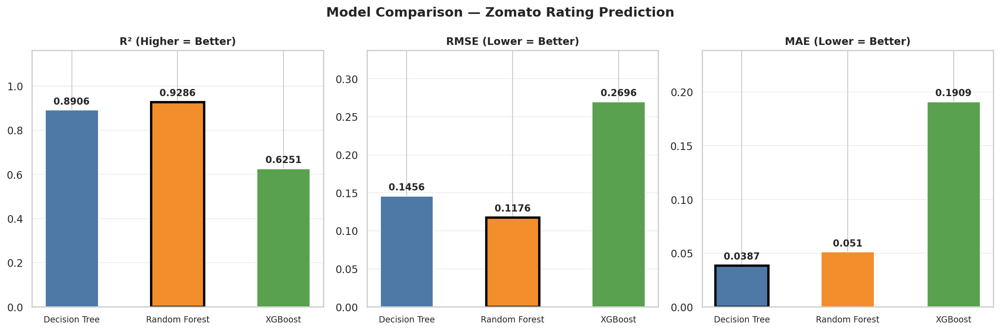
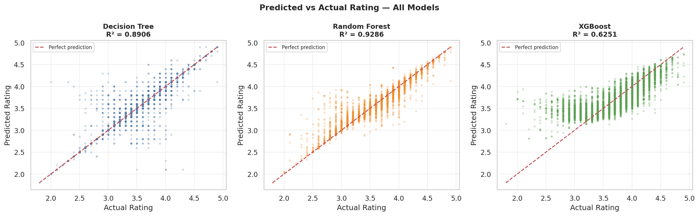
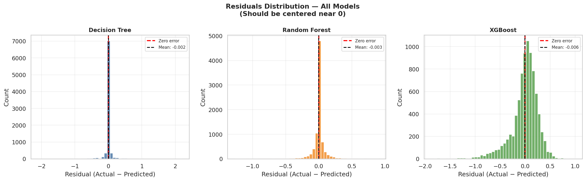
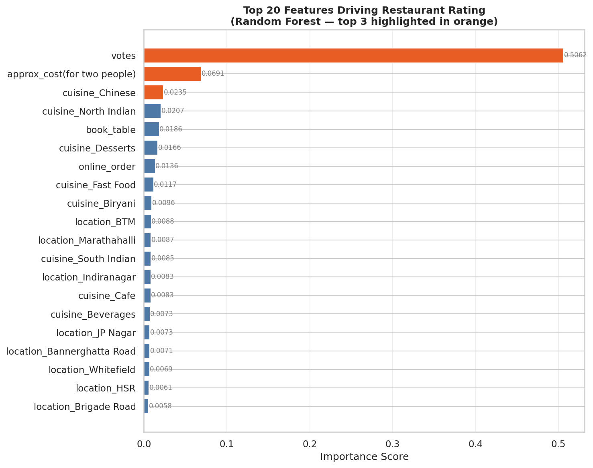
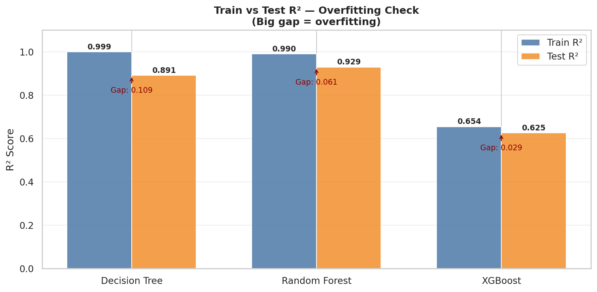

# 🍽️ Zomato Restaurant Rating Prediction

A supervised machine learning project that predicts restaurant ratings on the Zomato Bangalore platform using regression models — comparing Decision Tree, Random Forest, and XGBoost.

---

## 📌 Problem Statement

Given a restaurant's operational attributes (cost, cuisine, location, service options), can we predict its customer rating? This project builds and compares three regression models to answer that question and identify which factors most influence customer satisfaction.

---

## 📊 Dataset

- **Source:** [Zomato Bangalore Restaurants — Kaggle](https://www.kaggle.com/datasets/himanshupoddar/zomato-bangalore-restaurants)
- **Size:** ~51,000 restaurants (41,263 after cleaning)
- **Target variable:** `rate` — average customer rating (1.0 to 5.0)

---

## 🔧 Features Used

| Feature | Type | Encoding |
|---|---|---|
| votes | Numeric | As-is |
| approx_cost (for two) | Numeric | As-is (cleaned commas) |
| online_order | Binary | Yes → 1, No → 0 |
| book_table | Binary | Yes → 1, No → 0 |
| listed_in(type) | Categorical | One-hot encoded |
| location | Categorical | One-hot encoded |
| cuisines | Multi-label | Top 25 + MultiLabelBinarizer |

---

## 🧹 Data Cleaning Steps

- Stripped `/5` from `rate` column and converted to float
- Removed commas from `approx_cost` and converted to numeric
- Converted `online_order` and `book_table` from Yes/No to 1/0
- Dropped rows where `rate` was missing or `NEW` — target variable cannot be imputed
- Removed duplicate rows
- Multi-label binarized cuisines — capped at top 25 to avoid feature bloat

---

## 🤖 Models Trained

Three models trained on the same 80/20 train/test split (`random_state=324`):

| Model | R² | RMSE | MAE |
|---|---|---|---|
| Decision Tree | 0.8906 | 0.1456 | 0.0387 |
| **Random Forest** ✅ | **0.9286** | **0.1176** | **0.0510** |
| XGBoost | 0.6251 | 0.2696 | 0.1909 |

**Winner: Random Forest** with R² of 0.93 — predictions are within ±0.12 stars on average.

---

## 📈 Visualizations

### Model Comparison


### Predicted vs Actual


### Residuals Distribution


### Feature Importance (Random Forest — Top 20)


### Overfitting Check — Train vs Test R²


---

## 🔍 Key Finding

The overfitting check (Plot 5) reveals an important insight:

- **Decision Tree** has a Train R² of 0.999 vs Test R² of 0.89 — classic overfitting. It memorises training data rather than learning generalisable patterns.
- **Random Forest** reduces this gap significantly by averaging 100 trees, each trained on random subsets of data and features.
- **XGBoost** with `max_depth=4` is under-configured for a 208-feature dataset — increasing depth would improve performance significantly.

---

## 🛠️ Tech Stack

- Python 3.x
- pandas, numpy
- scikit-learn
- XGBoost
- matplotlib, seaborn

---

## 🚀 How to Run

```bash
# 1. Clone the repo
git clone https://github.com/YOUR_USERNAME/zomato-rating-prediction
cd zomato-rating-prediction

# 2. Install dependencies
pip install pandas numpy scikit-learn xgboost matplotlib seaborn

# 3. Run EDA
jupyter notebook eda_of_zomato.ipynb

# 4. Run models
python decisiontree_model.py
```

---

## 📁 Project Structure

```
zomato-rating-prediction/
│
├── eda_of_zomato.ipynb        # Data cleaning + EDA
├── decisiontree_model.py      # Model training + evaluation
├── final.csv                  # Cleaned dataset (output of EDA)
├── plots/
│   ├── plot1_model_comparison.png
│   ├── plot2_predicted_vs_actual.png
│   ├── plot3_residuals.png
│   ├── plot4_feature_importance_rf.png
│   └── plot5_overfitting_check.png
└── README.md
```

---

## 🔮 Future Work

- Fix XGBoost hyperparameters (`max_depth=6`, tune `n_estimators`) for fair comparison
- Deploy as a Streamlit web app — input restaurant details, get predicted rating
- Re-engineer features: frequency encode location, cap cuisines to top 25
- Add cross-validation for more robust evaluation

---

## 👤 Author

**Yash** — AIML Engineering Student | Restaurant Owner ([Wood N Smoke](https://www.instagram.com/woodn.smoke/), Jodhpur)

*This project is part of my ML portfolio. I also run a wood-fired pizza restaurant, so predicting what makes customers rate restaurants highly is more than just an academic exercise for me.*
